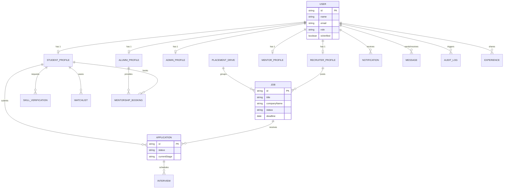
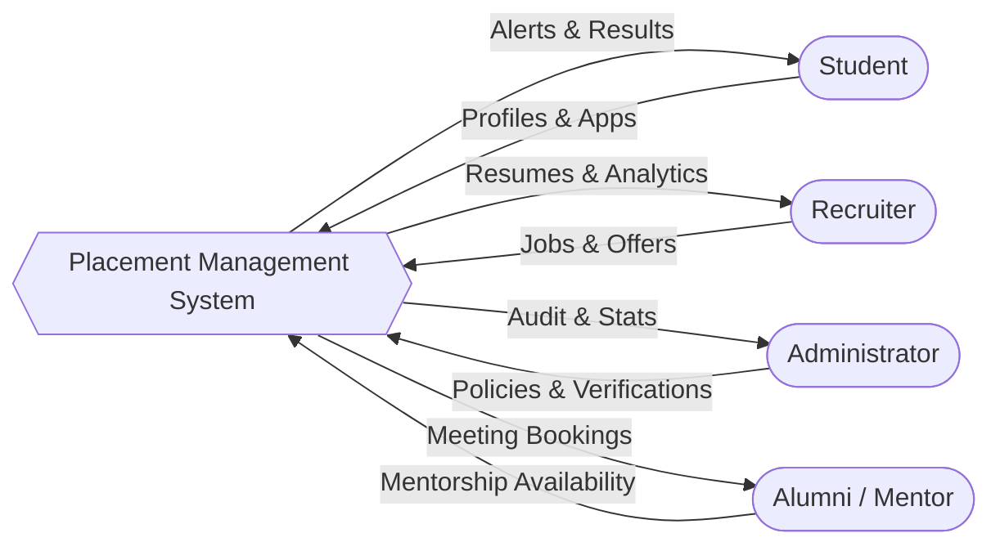
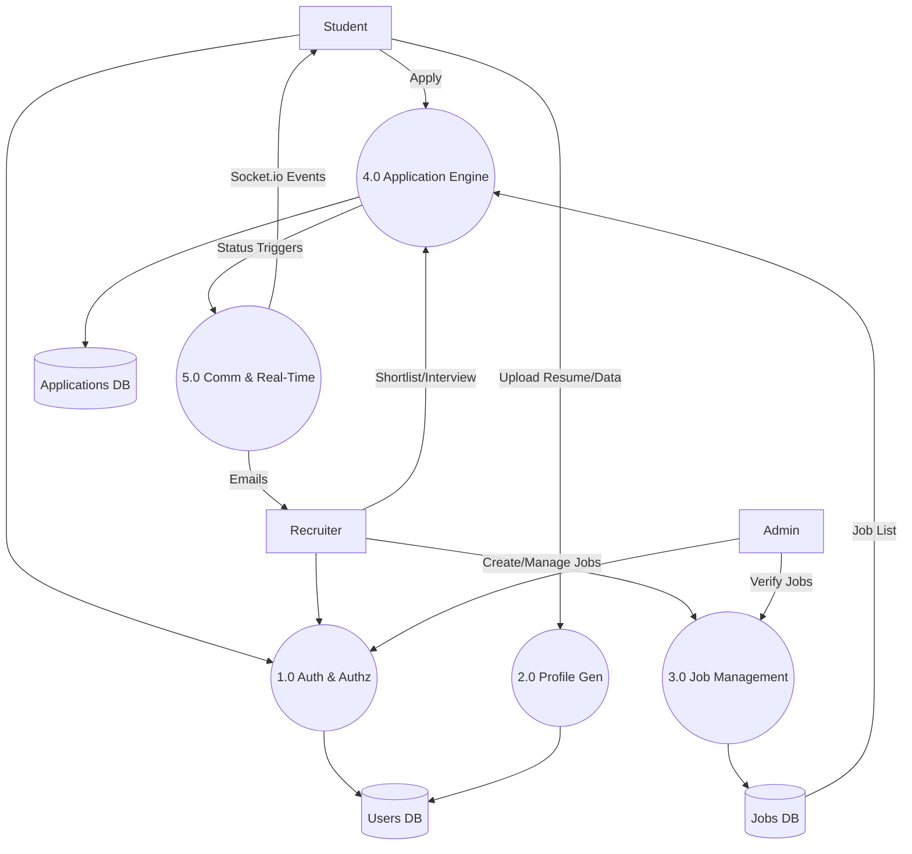
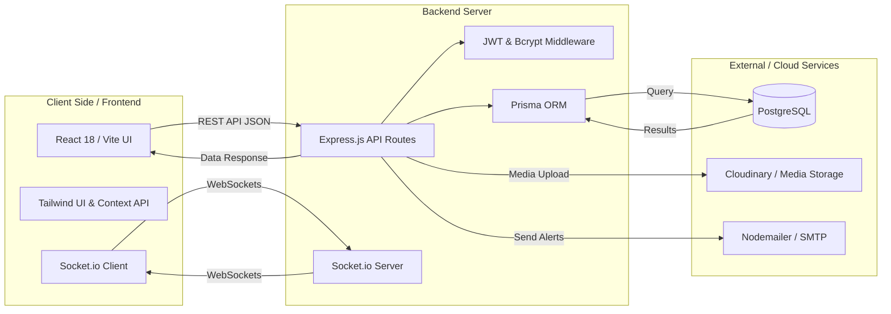

# System & Technical Architecture Document

## 1. Overview
This document outlines the technical architecture, database schema, and data flow of the **Placement Management System (PMS)**. The system is built using a modern full-stack architecture (MERN/PERN stack variation using PostgreSQL and Prisma ORM) and is designed to handle interactions between Students, Recruiters, Administrators, Mentors, and Alumni.

---

## 2. Entity-Relationship (ER) Diagram
The following diagram represents the core database entities and their relationships based on the Prisma schema.

---

## 3. Data Flow Diagrams (DFD)

### 3.1 DFD Level 0 (Context Diagram)
This diagram illustrates the macro-level interaction between the external entities and the Placement Management System.

### 3.2 DFD Level 1 (Core Processes)
This diagram details the primary internal processes of the system.

---

## 4. System Component Architecture

## 5. Security Architecture
- **Auth Layer:** JWT based authentication with strict OTP-based verification for critical actions.
- **Middleware Protections:** `Helmet` for HTTP headers, `Express-Rate-Limit` for protecting endpoints against brute force, and XSS cleaning.
- **Role-Based Access Control (RBAC):** Distinct controller paths for Student, Recruiter, Admin, and Alumni roles. Database relationships ensure a user can only edit their specific profile type.
